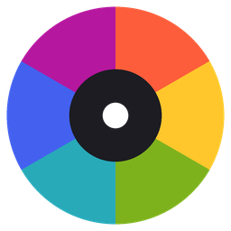

<p align="center">
  
</p>

# Synkronize

[](https://github.com/zthijs/synkronize/actions/workflows/validate.yml)
[](https://github.com/zthijs/synkronize/actions/workflows/lint.yml)
[](https://github.com/zthijs/synkronize/actions/workflows/test.yml)

**Your lights take the color of the album art that is playing.**

Synkronize watches a media player, grabs the artwork of the current track, and
picks the most *vibrant* color out of it - not the most common one, which on
album art is usually a near-black background. When the music stops, your lights
go back exactly as they were.

## Installation

[](https://my.home-assistant.io/redirect/hacs_repository/?owner=zthijs&repo=synkronize&category=integration)

Click the button above, or add `https://github.com/zthijs/synkronize` to HACS as
a custom repository with category **Integration**. Restart Home Assistant
afterwards.

## Features

- **Works with any media player** that publishes album art - Spotify, Sonos, Plex, Music Assistant, Chromecast.
- **Picks the vibrant color**, not the dull background one.
- **Five swatches per cover** - Vibrant, Light Vibrant, Dark Vibrant, Muted, Dominant - selectable from the light card's effect dropdown.
- **Multiple lights** get either the same color or one each, spread across the artwork's palette.
- **Puts your lights back** the way it found them when playback stops.
- **One normal light entity**, so it drops into any stock Tile, Mushroom, or Bubble card.

## Setup

**Settings → Devices & Services → Add Integration → Synkronize**, then pick:

- the **media player** whose artwork to follow, and
- the **lights** that should follow it (RGB-capable).

That creates one entity, named after the media player - following
`media_player.walkman` gives you `light.synkronize_walkman_sync`, titled
"Walkman Sync". Turn it on to start syncing.

```yaml
type: tile
entity: light.synkronize_walkman_sync
features:
  - type: light-brightness
```

## How it behaves

| You do this | Synkronize does this |
| --- | --- |
| Turn the entity **on** | Snapshots your lights, starts watching, applies the current artwork's color |
| Track changes | Re-extracts and re-applies (debounced, so skipping tracks does not strobe your room) |
| Pause briefly | Holds the color - the grace period has not elapsed |
| Stop, or pause past the grace period | Runs the idle behaviour (restore by default) |
| Pick an **effect** | Switches which swatch is used, and re-applies immediately |
| Pick a **color** by hand | Applies it directly; superseded at the next track change |
| Turn the entity **off** | Stops watching and runs the idle behaviour |

Playing something with no artwork at all (a radio stream) leaves the lights
alone rather than blanking them.

## Options

**Settings → Devices & Services → Synkronize → Configure**

| Option | Default | What it does |
| --- | --- | --- |
| Color to use | Vibrant | Which swatch to pull out of the artwork |
| With multiple lights | Spread | Spread the palette across lights, or one color on all of them |
| When playback stops | Restore | Restore the previous state, hold the last color, or turn the lights off |
| Wait before handing back | 10 s | Grace period, so a quick pause does not disturb the lights |
| Fade duration | 2 s | Transition applied to every color change |
| Saturation boost | 0.4 | How far the extracted color is pushed toward fully saturated |
| Minimum saturation | 0.35 | Below this, a palette color is not considered vibrant |

Saving options reloads the entry, so changes take effect immediately.

Minimum saturation is a preference, not a hard floor. Plenty of covers are
monochrome and have nothing more colorful to offer, so when nothing clears the
bar Synkronize relaxes it in rounds rather than giving up. You always get a
color.

## Development

```bash
scripts/setup      # install dependencies
scripts/develop    # run Home Assistant on http://localhost:8123
scripts/lint       # ruff format + check
python3 -m pytest tests/
```

`config/configuration.yaml` enables the `demo` integration, which provides
`media_player.lounge_room` (it has album art) and `light.bed_light` /
`light.ceiling_lights`, so the whole feature can be exercised without any real
hardware.

The color scoring in `custom_components/synkronize/color_extractor.py` is
deliberately made of pure functions, so it is unit-testable without a Home
Assistant instance - see `tests/test_color_extractor.py`.

### Layout

| Module | Responsibility |
| --- | --- |
| `light.py` | The `light.synkronize_*` entity: state, effects, and the extract-and-apply pipeline |
| `color_extractor.py` | ColorThief extraction, vibrancy scoring, saturation boost |
| `album_art.py` | Resolving and downloading `entity_picture` |
| `media_watcher.py` | Artwork-change detection, debouncing, idle grace timer |
| `light_controller.py` | Talking to the real lights, with per-light error tracking |
| `snapshot.py` | Capturing and restoring the pre-sync light state |
| `config_flow.py` | Setup and options flows |
| `brand/` | Integration icon, served by Home Assistant straight from the repository |

## License

MIT
